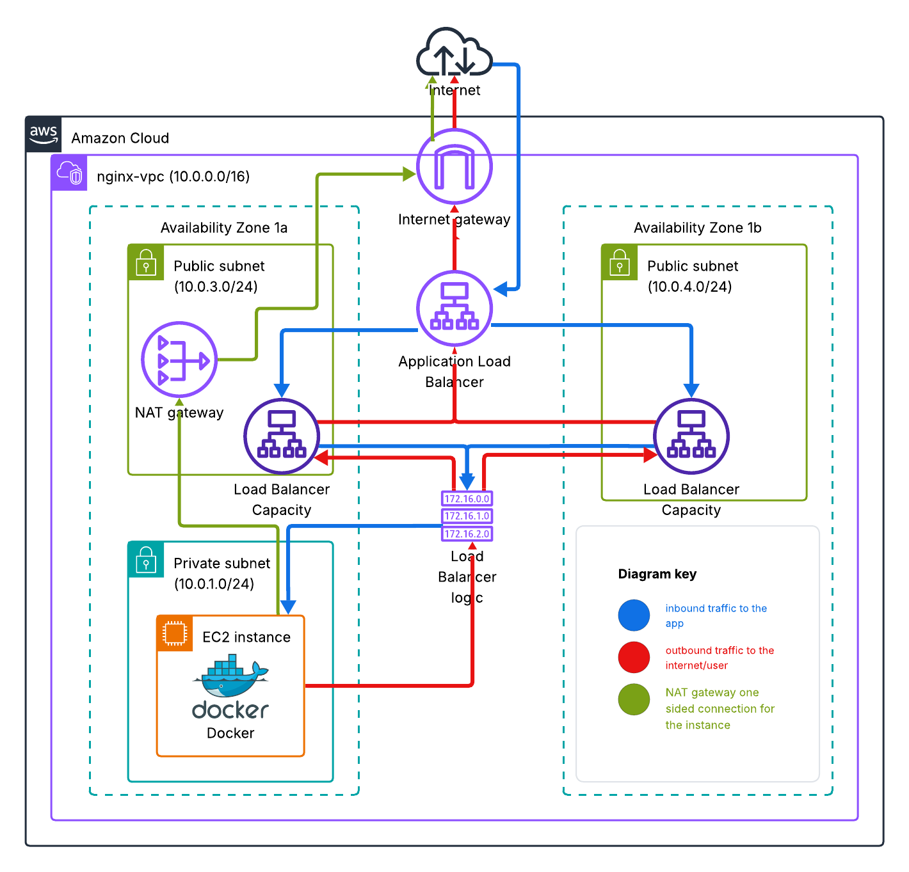

# 🚀 nginx-vpc — Terraform AWS Infrastructure

## Overview
This project provisions an AWS environment (region **il-central-1**) with:

| Tier | Resources | Purpose |
|------|-----------|---------|
| Network Edge | **Internet Gateway (IGW)** | Allows inbound HTTP and outbound egress |
| Public Subnets (×2) | • **NAT Gateway** (Subnet-1)<br>• **Application Load Balancer** (spans both) | NAT gives the private subnet one-way Internet access; ALB fronts incoming traffic |
| Private Subnet | **EC2** instance running a **Docker-built NGINX** app | Receives traffic from the ALB; egress via NAT only |

High-level traffic:
* **Inbound**  `Internet → IGW → ALB → EC2`
* **Outbound** `EC2 → NAT Gateway → IGW → Internet`

---

## Architecture Diagram



---

## Repository Layout

```text```
.
├── main.tf
├── provider.tf
├── variables.tf
├── output.tf
└── modules/
    ├── networking/      # VPC, subnets, IGW, NAT Gateway, route tables
    ├── load_balancer/   # ALB, target group, listener, security groups
    └── nginx/           # EC2, SG, user-data (installs Docker & builds NGINX image)
Prerequisites
Terraform ≥ 1.6

AWS CLI configured with create-vpc permissions

Optional: an AWS key pair if you need SSH access to the EC2 instance

Quick Start
bash
Copy
Edit
# 1 — Clone the code
git clone https://github.com/persiidan/Moveo_Assignment.git
cd Moveo_Assignment

# 2 — Initialise Terraform
terraform init

# 3 — Review (optional but recommended)
terraform plan

# 4 — Apply the configuration
terraform apply
# ↳ confirm with 'yes' when prompted
Terraform outputs the ALB DNS name on success:

text
Copy
Edit
Outputs:
alb_dns = http://nginx-alb-xxxx.il-central-1.elb.amazonaws.com
Open that URL in a browser—you should see the NGINX welcome page served from the EC2 instance in the private subnet.

How the NGINX Module Works
User-data (in modules/nginx/user_data.sh) runs on first boot.

It installs Docker, then builds the image from the included Dockerfile.

The container starts, listening on port 80.

Security groups allow the ALB to reach port 80; no inbound Internet traffic reaches the EC2 directly.

Variables You May Override
Variable	Default	Description
aws_region	il-central-1	Deployment region
vpc_name	nginx-vpc	VPC name tag
app_port	80	Container port exposed to the ALB
(others in variables.tf)		

Destroying Everything
bash
Copy
Edit
terraform destroy
All resources—including the VPC—are removed.

Troubleshooting Tips
Stuck at “Instance failed health checks” → ensure the container really listens on port 80.

Timeout reaching ALB DNS → verify security-group rules in the load_balancer and nginx modules.

Need SSH → add your key pair ID to variables.tf and open port 22 from your IP in the EC2 SG.

Happy shipping! 🚢

vbnet
Copy
Edit

If anything still needs tweaking—labels, wording, or additional commands—just let me know.


